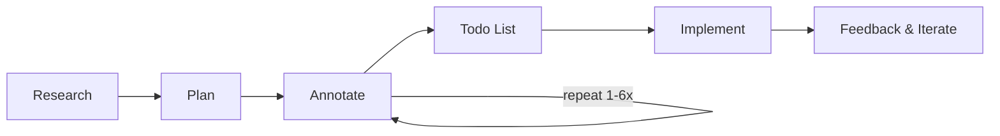
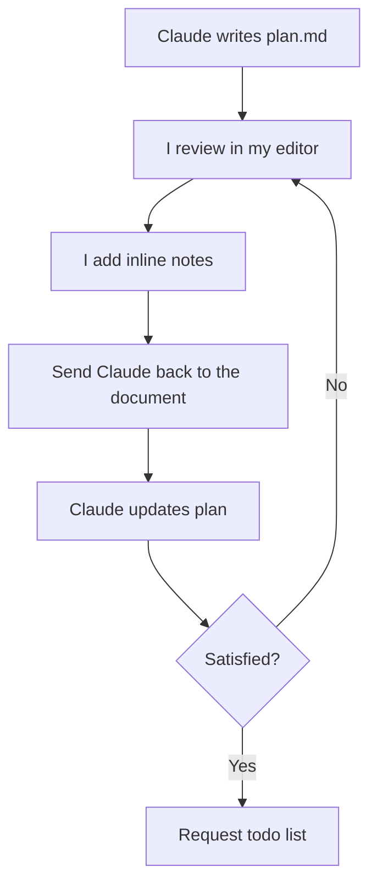
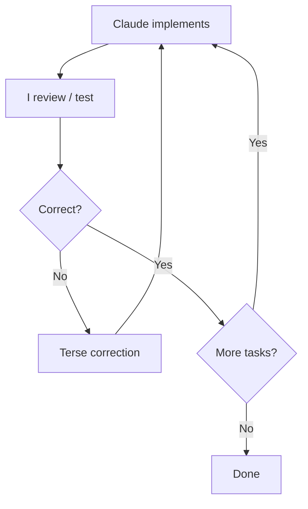
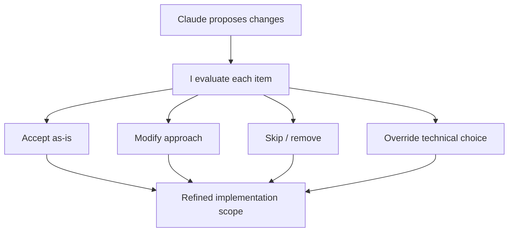

Boris Tane nutzt Claude Code seit über 9 Monaten als primäres Entwicklungswerkzeug. Sein Workflow unterscheidet sich radikal von der typischen "Prompt & Fix" Methodik. Der Kernsatz seines Ansatzes lautet:

> **Lass Claude niemals Code schreiben, bevor du einen schriftlichen Plan geprüft und freigegeben hast.**

Diese strikte Trennung verhindert unnötigen Token-Verbrauch, bewahrt die Kontrolle über Architektur-Entscheidungen und liefert signifikant bessere Ergebnisse.

## Die drei Phasen des Workflows

Der Workflow besteht aus einer disziplinierten Pipeline, die Denken von Tippen trennt.

### Phase 1: Research (Tiefenanalyse)

Jede bedeutsame Aufgabe beginnt mit einer Deep-Read Anweisung. Claude wird angewiesen, den relevanten Teil der Codebase gründlich zu verstehen, bevor Änderungen vorgeschlagen werden.

*   **Artefakt:** Die Ergebnisse müssen zwingend in eine `research.md` Datei geschrieben werden.
*   **Sprache:** Nutze Begriffe wie "deeply", "in great details" oder "intricacies". Ohne diese Signale tendiert die KI dazu, Oberflächenanalysen durchzuführen.
*   **Zweck:** Die `research.md` dient als Review-Fläche. Wenn die Analyse falsch ist, wird auch der Plan und die Implementierung scheitern.

### Phase 2: Planning (Der Planungs-Zyklus)

Nach der Analyse folgt die Erstellung einer `plan.md`. Boris nutzt bewusst nicht den eingebauten "Plan Mode" von Claude Code, da eine eigene Markdown-Datei mehr Kontrolle bietet und als persistentes Artefakt im Projekt bleibt.

#### Der Annotations-Zyklus (Das Herzstück)
Dies ist der wichtigste Teil des Workflows. Nachdem Claude den ersten Entwurf der `plan.md` geschrieben hat, erfolgt ein iterativer Prozess:

1.  **Review:** Du öffnest die `plan.md` in deinem Editor.
2.  **Annotation:** Du fügst Notizen, Korrekturen oder Einschränkungen direkt inline in das Dokument ein (z.B. "Nutze Drizzle für Migrationen, kein raw SQL" oder "Das sollte ein PATCH sein, kein PUT").
3.  **Update:** Du schickst Claude zurück zum Dokument: *"Ich habe Notizen hinzugefügt, aktualisiere das Dokument entsprechend. Noch nicht implementieren!"*

Dieser Zyklus wiederholt sich 1 bis 6 Mal, bis der Plan perfekt sitzt. Die Markdown-Datei fungiert hierbei als **Shared Mutable State**.

#### Die Todo-Liste
Bevor die Implementierung startet, muss Claude eine granulare Checkliste in die `plan.md` integrieren. Dies dient als Fortschrittstracker, den Claude während der Arbeit selbstständig aktualisiert.

### Phase 3: Implementation (Mechanische Ausführung)

Wenn der Plan steht, wird der Implementierungsbefehl erteilt. Boris nutzt hierfür einen standardisierten Prompt:

> *"Implement it all. When you’re done with a task or phase, mark it as completed in the plan document. Do not stop until all tasks and phases are completed. Do not add unnecessary comments or jsdocs, do not use any or unknown types. Continuously run typecheck to make sure you’re not introducing new issues."*

In dieser Phase verschiebt sich deine Rolle vom Architekten zum Supervisor. Korrekturen während der Implementierung sollten kurz und prägnant sein ("Deduplizierung vergessen", "Settings-Page verschieben").

## Warum dieser Workflow gewinnt

*   **Boring Implementation:** Die kreative Arbeit findet im Planungszyklus statt. Die eigentliche Code-Generierung wird mechanisch und fehlerfrei.
*   **Vermeidung von Regressions:** Da Claude den Kontext durch Research und Annotationen tief verinnerlicht hat, entstehen kaum Implementierungen, die zwar isoliert funktionieren, aber das Gesamtsystem stören.
*   **Single Long Sessions:** Boris empfiehlt, Research, Planung und Implementierung in einer einzigen, langen Session durchzuführen. Die Performance-Degradierung bei großen Kontexten wird durch Claudes Auto-Compaction und das persistente Plan-Dokument kompensiert.

### Fazit in einem Satz
Lies tiefgründig, schreibe einen Plan, annotiere den Plan, bis er stimmt, und lass Claude dann ohne Unterbrechung ausführen, während ständig die Typen geprüft werden.
