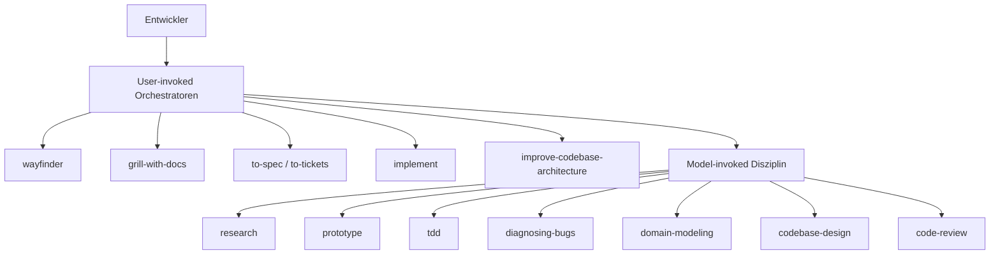
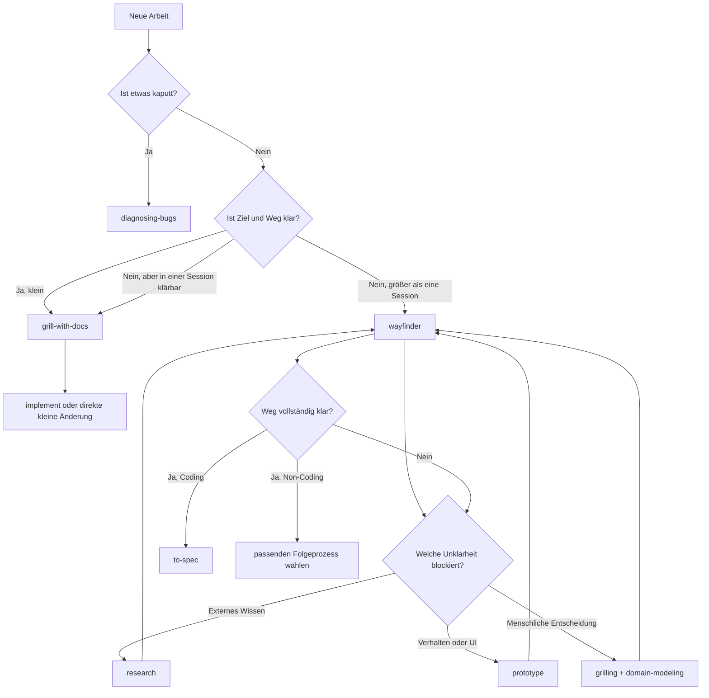
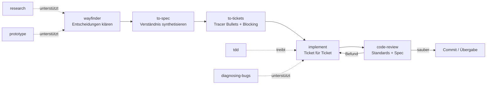
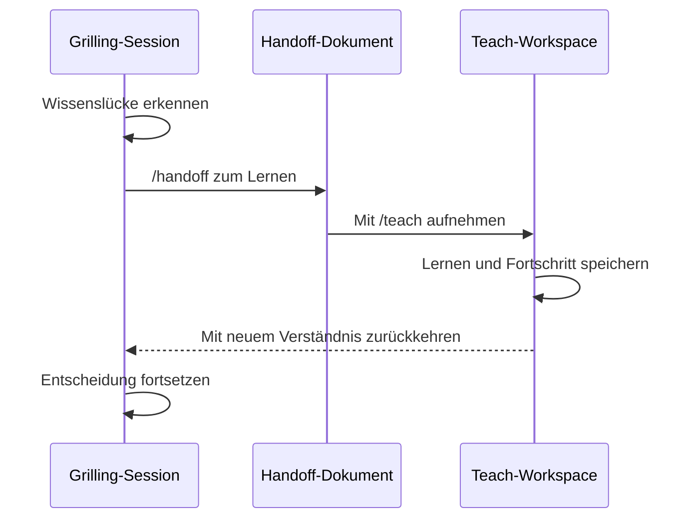

# Matt Pococks Skills: Praxisguide für Entwickler

Dieser Guide zeigt, wie du mattpocock/skills als kleines, komponierbares System verwendest. Der Schwerpunkt liegt auf Wayfinder und dem Weg von einer unscharfen Idee zu überprüfter Software. 

## Kurzfassung

1. Richte die Skills pro Repository mit `/setup-matt-pocock-skills` ein.
2. Kläre normale Änderungen mit `/grill-with-docs`; nutze `/wayfinder` nur für Arbeit, deren Weg noch nicht in eine Agent-Session passt.
3. Behandle Wayfinder bei Coding als Exploration: ein Investigation Ticket pro Session, bis keine relevante Entscheidung mehr offen ist.
4. Übergib danach über `/to-spec → /to-tickets → /implement`; `/implement` schließt mit `/code-review` ab.
5. Nutze `research`, `prototype`, `tdd`, `diagnosing-bugs` und `codebase-design` als Disziplin-Skills innerhalb der passenden Orchestratoren.

> [!NOTE]
> **Evidenz:** „Verifiziert“ bedeutet in den lokal geklonten Skill-Dateien geprüft. „Autor-Empfehlung“ stammt aus Matt Pococks Tweets oder README. „Erfahrungsbericht“ ist eine Beobachtung anderer Nutzer. „Empfehlung dieses Guides“ ist die daraus abgeleitete Praxis.

## Das mentale Modell: Orchestrierung und Disziplin

Die Sammlung ist kein einzelnes Framework, das jeden Schritt übernimmt. Sie besteht aus kleinen Skills gegen konkrete Fehlermodi: Missverständnisse, fehlende Feedback-Loops, unklare Domänensprache und architektonischer Verfall. Du stellst den Ablauf passend zur Arbeit zusammen. Siehe [[Klein-und-komposierbar]] und [[One-File-per-Failure-Mode]].

Die Skills sind entlang einer Achse getrennt: **Wer darf sie starten?**



- **User-invoked:** Du startest den Skill bewusst per Slash-Command. Er orchestriert einen Arbeitsabschnitt.
- **Model-invoked:** Der Agent oder ein Orchestrator darf den Skill bei passender Aufgabe erreichen. Er enthält wiederverwendbare Disziplin.
- **Invariante:** Ein user-invoked Orchestrator kann model-invoked Skills nutzen, aber keinen anderen user-invoked Orchestrator automatisch starten. Die Übergänge zwischen `/wayfinder`, `/to-spec`, `/to-tickets` und `/implement` bleiben deshalb bewusste Nutzerentscheidungen. Siehe [[Skill-Call-Hierarchie]].

## Installation und Setup

Installiere oder aktualisiere die Sammlung:

```bash
npx skills@latest add mattpocock/skills
```

Wähle die benötigten Skills und unbedingt `setup-matt-pocock-skills`. Starte anschließend im Ziel-Repository:

```text
/setup-matt-pocock-skills
```

Das Setup dokumentiert drei Dinge unter `docs/agents/`:

- Issue-Tracker und dessen Operationen,
- Triage-Labels,
- Ablage für Domain-Dokumente wie `CONTEXT.md` und ADRs.

GitHub und lokale Markdown-Issues werden direkt unterstützt. GitLab oder ein anderer programmatisch erreichbarer Tracker kann als projektspezifische Konvention beschrieben werden. Die fachlichen Skills bleiben gleich; nur der Adapter in `docs/agents/issue-tracker.md` ändert sich. Das ist im Repo verifiziert. Matts stärkere Aussage „works with literally anything“ solltest du praktisch als „alles mit ausreichend dokumentierbaren, programmatisch erreichbaren Operationen“ lesen.

## Welchen Einstieg solltest du wählen?



Praktische Faustregel:

- **Bug oder Performance-Regression:** `diagnosing-bugs`.
- **Kleine, klar begrenzte Codeänderung:** zuerst `/grill-with-docs`, dann umsetzen; Wayfinder wäre unnötiger Overhead.
- **Große, unscharfe Änderung:** `/wayfinder`.
- **Nur eine externe Sachfrage:** `research` eigenständig verwenden.
- **Nur eine Designfrage:** `prototype` eigenständig verwenden.
- **Codebase wird schwer veränderbar:** `/improve-codebase-architecture`.
- **Du weißt nicht, welcher Skill passt:** `/ask-matt` als Router.

## Der empfohlene Coding-Lifecycle

Für große Coding-Vorhaben lautet Matts veröffentlichte Empfehlung:



### 1. Wayfinder findet den Weg

Wayfinder eignet sich für ein Ziel, dessen Entscheidungsweg noch im Nebel liegt. Das kanonische Artefakt ist eine Map auf dem konfigurierten Issue-Tracker.

Die Map enthält:

- **Destination:** Woran erkennst du, dass der Weg gefunden ist?
- **Decisions so far:** knappe Links zu abgeschlossenen Investigation Tickets,
- **Not yet specified:** sichtbarer Nebel, der noch nicht präzise genug für ein Ticket ist,
- **Out of scope:** bewusst ausgeschlossene Arbeit.

Investigation Tickets beantworten Fragen, statt bereits das Endprodukt zu liefern:

- **Research, AFK:** Primärquellen untersuchen und ein zitiertes Markdown-Artefakt verlinken.
- **Prototype, HITL:** ein billiges, wegwerfbares Artefakt erzeugen, auf das ein Mensch reagieren kann.
- **Grilling, HITL:** eine Entscheidung mit dem zuständigen Menschen klären.
- **Task, HITL oder AFK:** notwendige Vorarbeit erledigen, die erst eine spätere Entscheidung ermöglicht.

### 2. Arbeite genau ein Wayfinder-Ticket pro Session

Dieser Punkt ist im Skill ausdrücklich bindend:

1. Map laden, nicht sofort alle Ticket-Details.
2. Ein offenes, unblockiertes und nicht beanspruchtes Frontier-Ticket wählen.
3. Ticket vor der Arbeit claimen.
4. Frage mit dem passenden Disziplin-Skill beantworten.
5. Entscheidung im Ticket festhalten und Ticket schließen.
6. Neu sichtbare Fragen als Tickets anlegen; weiterhin unscharfe Fragen im Fog lassen.
7. Session beenden.

Die Begrenzung verhindert, dass eine Session die gesamte Map in ihren Kontext zieht oder mehrere Entscheidungen halb löst. Ein Erfahrungsbericht bezeichnet gerade dieses Session-Sizing als besondere Stärke von Wayfinder; das ist nützliches Feedback, aber keine Garantie für jedes Projekt. Siehe [[Task-basierte-Steuerung]].

### 3. Stoppe Wayfinder an der richtigen Grenze

Der Default lautet: **Plan, don't do.** Sobald du spürst, dass das Team nun einfach implementieren könnte, ist das meist das Signal für die Übergabe.

Führe Wayfinder nicht weiter, nur weil noch beliebige Delivery-Aufgaben formulierbar wären. Die Map ist fertig, wenn vor der Umsetzung keine relevante Entscheidung mehr offen ist. Eine Ausnahme muss ausdrücklich in den Notes der Map festgehalten werden. Das kann für Kursentwicklung oder andere nicht-codierende Arbeit sinnvoll sein.

### 4. `/to-spec` verdichtet die geklärte Map

```text
/to-spec <Wayfinder-Map>
```

`to-spec` führt kein neues Interview. Der Skill synthetisiert vorhandenen Kontext und Codebase-Verständnis in Problem Statement, Solution, User Stories, Implementation Decisions, Testing Decisions und Out of Scope. Wenn hier wieder fundamentale Fragen auftauchen, war Wayfinder noch nicht fertig.

### 5. `/to-tickets` erzeugt lieferbare Tracer Bullets

```text
/to-tickets <Spec-Link>
```

Jedes Ticket soll einen vertikalen, überprüfbaren Ausschnitt liefern und seine Blocking Edges nennen. Ein Ticket ist klein genug, wenn ein Agent es mit klarem Feedback-Loop in frischem Kontext abschließen kann. Breite mechanische Refactorings sind die Ausnahme: Sie werden per Expand–Migrate–Contract geschnitten.

### 6. `/implement` liefert gegen Spec oder Tickets

```text
/implement <Ticket-Link>
```

`implement` nutzt TDD an den zuvor vereinbarten Seams und beendet die Arbeit mit `code-review`. Arbeite die Frontier ab: nur Tickets, deren Blocker erledigt sind. Lösche zwischen Tickets den Kontext oder starte eine frische Session, statt den gesamten Backlog mitzuschleppen.

### 7. `code-review` prüft zwei getrennte Achsen

- **Standards:** Passt die Änderung zu den dokumentierten Regeln des Repositories und zu einer kuratierten Code-Smell-Baseline?
- **Spec:** Erfüllt der Diff die ursprüngliche Spec ohne Lücken oder Scope Creep?

Diese Trennung verhindert, dass gute Codequalität fehlende Anforderungen verdeckt oder eine formal vollständige Umsetzung schlechte Struktur entschuldigt.

## Kleine Änderungen brauchen keinen Wayfinder

Ein schlanker Standardfluss reicht, wenn Ziel, Scope und technische Richtung in einer Session geklärt werden können:

```text
/grill-with-docs die gewünschte Änderung
→ gemeinsame Sprache und Entscheidungen klären
→ kleine Umsetzung mit tdd
→ code-review gegen einen festen Ausgangspunkt
```

`grill-with-docs` pflegt neben der Klärung auch `CONTEXT.md` und ADRs. Eine präzise Domänensprache reduziert lange Umschreibungen, stabilisiert Namen in Code und Dokumenten und spart in späteren Sessions Kontext. Siehe [[Spec-Grilling]] und [[CONTEXT-Glossar]].

## Wenn du während des Grilling etwas nicht verstehst

Matt empfiehlt, die Lernschleife aus dem Grilling-Kontext herauszulösen:



Praktisches Rezept:

```text
Ich verstehe <Begriff oder Entscheidung> noch nicht.
/handoff to a teaching agent to understand this
```

Öffne das Handoff-Dokument danach in einem eigenen Teaching-Workspace mit `/teach`. Kehre erst nach der Lernschleife zur ursprünglichen Session zurück. Das Handoff liegt laut Skill im temporären OS-Verzeichnis und verweist auf vorhandene Specs, Issues oder ADRs, statt sie zu kopieren. Siehe [[Handoff-Doc]].

## Architekturpflege als Routine

Agenten beschleunigen nicht nur Feature-Arbeit, sondern auch Software-Entropie. Matt empfiehlt im README, `/improve-codebase-architecture` alle paar Tage auszuführen. Das ist eine Autor-Empfehlung, kein universeller Kalender: Richte die Frequenz nach Änderungsrate und Architekturrisiko.

```text
/improve-codebase-architecture
```

Der Skill:

1. untersucht die Codebase mit dem Vokabular aus `codebase-design`,
2. sucht nach Möglichkeiten, Module zu vertiefen und Interfaces zu verkleinern,
3. erstellt einen visuellen HTML-Report mit Kandidaten,
4. lässt dich einen Kandidaten auswählen,
5. klärt die Änderung anschließend im Grilling-Loop.

Er ist kein automatischer Groß-Refactor. Der Report ist eine Entscheidungsgrundlage; Umsetzung und Verifikation folgen separat.

## Konkrete Rezepte

### Große, unscharfe Feature-Idee

```text
/wayfinder Finde den Weg zu <Destination>. Standard: Entscheidungen klären, keine Delivery in der Map.
```

Nach Abschluss:

```text
/to-spec <Map-Link>
/to-tickets <Spec-Link>
/implement <erstes unblockiertes Ticket>
```

### Schwierige externe API-Frage

```text
Research <präzise Frage> anhand offizieller Dokumentation, Spezifikation und Primärquellen. Speichere das Ergebnis als zitierte Markdown-Datei.
```

### Unklare UI- oder Zustandsentscheidung

```text
Prototype <konkrete Designfrage>. Das Artefakt ist wegwerfbar; halte anschließend nur die validierte Entscheidung fest.
```

### Hartnäckiger Bug

```text
Diagnose <Fehlerbild> mit reproduce → minimise → hypothesise → instrument → fix → regression test.
```

### Session geordnet übergeben

```text
/handoff <Fokus der nächsten Session>
```

Nutze Handoff für Session-Zustand, nicht als zweite Kopie von Spec, Plan, ADR, Issue, Commit oder Diff.

## Häufige Fehlanwendungen

| Fehlanwendung | Warum sie schadet | Bessere Vorgehensweise |
|---|---|---|
| Wayfinder für jede Kleinigkeit | Map und Tracker erzeugen mehr Koordination als Erkenntnis | Kleine Änderung mit `grill-with-docs`, TDD und Review bearbeiten |
| Wayfinder als komplette Coding-Pipeline | Exploration und Delivery vermischen sich | Map abschließen, dann `to-spec → to-tickets → implement` |
| Die gesamte Fog-of-War-Zone vorab in Tickets schneiden | Unbekannte Arbeit wird als falsche Gewissheit modelliert | Nur präzise formulierbare Fragen ticketisieren |
| Mehrere Investigation Tickets in einer Session lösen | Kontext wächst, Entscheidungen werden halb fertig | Genau ein Ticket pro Session |
| Prototyp wie Production Code behandeln | Lernartefakt bekommt unnötige Tests und Architektur | Wegwerfbar halten, Entscheidung sichern, Prototyp außerhalb von `main` referenzieren |
| Handoff kopiert alle Artefakte | Mehrere Wahrheiten driften auseinander | Bestehende Artefakte verlinken |
| Tracker ohne Setup verwenden | Skills kennen Create/Close/Block/Frontier-Operationen nicht | Zuerst `/setup-matt-pocock-skills` ausführen |
| Erfahrungsbericht als Garantie lesen | „Mehr Autonomie“ und gutes Session-Sizing sind kontextabhängig | Repo-Regeln von Nutzerbeobachtungen trennen |

## Grenzen des Systems

- Die Leichtgewichtigkeit überlässt dir mehr Prozessentscheidung als GSD, BMAD oder Spec-Kit. Das ist Kontrolle, aber auch Verantwortung.
- Wayfinder braucht einen Issue-Tracker oder lokale Markdown-Konventionen mit ausreichend klaren Operationen für Map, Child Tickets, Blocking und Frontier.
- Research setzt Hintergrundagenten voraus; Code Review nutzt in seiner Referenzimplementierung parallele Subagents. Auf Plattformen ohne diese Fähigkeiten muss der Ablauf seriell adaptiert werden.
- Die Skills sind veränderbare Markdown-Artefakte. Prüfe nach Updates Changelog und projektspezifische Anpassungen, bevor du alte Abläufe unverändert fortsetzt.

## Quellen

- [mattpocock/skills auf GitHub](https://github.com/mattpocock/skills) — Primärquelle für Installation, Skill-Hierarchie, die beschriebenen Orchestratoren und Disziplin-Skills.

## Verbindungen

- [[Agent Skills]]
- [[Agent Workflows]]
- [[Wayfinder]]
- [[TDD]]
- [[Code Review]]
- [[Claude Code]]
